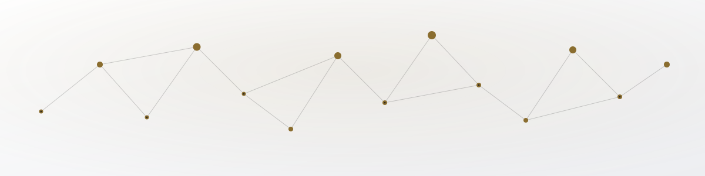

<div align="center">

<picture>
  <source media="(prefers-color-scheme: dark)" srcset="assets/hero-dark.svg">
  
</picture>

<br/><br/>

<h1 align="center">Syed Ebtisam Ali</h1>
<p align="center"><i>IT Director · Builder · AI Tinkerer · Researcher</i></p>

<a href="https://github.com/syedebtisamali">
  
</a>

<br/>

<a href="#about"></a>
<a href="#tech-stack"></a>
<a href="#projects"></a>
<a href="#research"></a>
<a href="#certifications"></a>
<a href="#stats"></a>
<a href="mailto:syedebtisamali@gmail.com"></a>

<br/><br/>


</div>


<a name="about"></a>

##  &nbsp;About

<table>
<tr>
<td width="58%" valign="top">

```yaml
name: "Syed Ebtisam Ali"
role: "IT Director @ NGO  ·  College Student"
education: "Intermediate Computer Science, Forman Christian College"
timeline: "2025 - 2027"
languages: ["C", "C++", "Python", "JavaScript", "TypeScript"]
currently_exploring: ["Machine Learning", "ANN", "LLMs", "Prompt Engineering"]
research_published: true
```

</td>
<td width="42%" valign="top">

**·** IT Director — tech & digital ops at an NGO
**·** Published researcher (DOI-linked paper below)
**·** Competitor — hackathons, MUNs, pitch contests
**·** Writes poetry & stories on the side
**·** 30+ personal projects across web, C, Python & AI

</td>
</tr>
</table>


<a name="tech-stack"></a>

##  &nbsp;Tech Stack

<div align="center">


<br/><br/>

**AI Tools**


</div>

<details>
<summary><b>Full skill matrix</b></summary>
<br/>

<div align="center">

**Programming**
      

**Web & Apps**
       

**AI / ML / Data**
     

**Design & Media**
   

**Marketing & Growth**
   

**Tools & Platforms**
    

**Leadership & Ops**
     

**Languages**
  

</div>

</details>


<a name="projects"></a>

##  &nbsp;Projects

<div align="center">

<table>
<tr>
<td align="center" width="33%">
<a href="https://worldschat.netlify.app"></a><br/><sub>Real-time chat · HTML/CSS/JS · Firebase</sub>
</td>
<td align="center" width="33%">
<a href="https://logicalsea.netlify.app"></a><br/><sub>Logic-driven web design</sub>
</td>
<td align="center" width="33%">
<a href="https://onesea.netlify.app"></a><br/><sub>Search-style web app</sub>
</td>
</tr>
<tr>
<td align="center" width="33%">
<a href="https://saw-ai.netlify.app"></a><br/><sub>AI-powered web application</sub>
</td>
<td align="center" width="33%">
<a href="https://happyteachersday-2025.netlify.app/?user=Sir%20Ali"></a><br/><sub>Dynamic personalized tribute</sub>
</td>
<td align="center" width="33%">
<a href="#project-vault"></a><br/><sub>C, Python, games & tools</sub>
</td>
</tr>
</table>

</div>

<a name="project-vault"></a>

### Project Vault

<details>
<summary><b>C Projects</b></summary>
<br/>

| Project | Description |
|---|---|
| **RCS** *(Rubik's Cube Simulation, 2025)* | Algorithmic cube rotations, move validation, modular architecture |
| **Snake Game** *(2024)* | Classic snake, built from scratch |
| **Fish Simulation** | With a food-adding mechanic |
| **Age Teller** | Simple age calculator |
| **Calculator** | Basic arithmetic calculator |
| **Virus (System)** | System-level experiment |
| **C CMD** | Custom command-line tool |
| **Tic Tac Toe** | Two-player console game |
| **Guess the Numbers ×4** | Number guessing variants |
| **Broken Block** | Puzzle/logic project |
| **PrintX** | Also ported to Python |

</details>

<details>
<summary><b>HTML / CSS / JS Projects</b></summary>
<br/>

| Project | Description |
|---|---|
| **Worlds Chat** | Real-time chat platform |
| **Logical Sea** | Logic-based web experiment |
| **Sea Search Engine** | Custom search interface |
| **FireSnake** | Snake game, web edition |
| **Fire Space** | Interactive web experience |
| **SAW** | AI-powered web app |
| **SEA Compiler** | Also built in C++ |

</details>

<details>
<summary><b>Python Projects</b></summary>
<br/>

| Project | Description |
|---|---|
| **Next Word Predictor** | Markov-Chain based ML model |
| **Sea Shell 2025** | Custom shell integrated with an online AI API |
| **DOSA** *(Denial of Service Attack)* | Networking/security experiment |
| **Encryption Decryption Tool** | Text cipher utility |
| **QR Code Generator** | Generates QR codes from links |
| **PrintX** | Also built in C |

</details>

<details>
<summary><b>Other Projects, Libraries & Games</b></summary>
<br/>

**Tools & Simulations**
- **WhatsApp Messenger (W MAG)**
- **Collision Simulations** — elastic & inelastic physics
- **Lo-CAM**
- **Xsolver**
- **Interpreter** — for a custom language
- **Algorithmical Language** — a language design project

**Libraries**
- **visuals.py** — custom Python visuals library

**Games**
- **DRG** — Dice Rolling Game
- **NGG** — Number Guessing Game
- **RPSG** — Rock, Paper, Scissors Game

</details>


<a name="research"></a>

##  &nbsp;Research

<div align="center">

<a href="https://doi.org/10.13140/RG.2.2.17665.42087">

</a>

</div>


<a name="certifications"></a>

##  &nbsp;Certifications &amp; Achievements

<div align="center">


</div>
<br/>

<details>
<summary><b>Sololearn</b> (15 courses)</summary>
<br/>

| Course | Date |
|---|---|
| Introduction to C++ | 25 Dec 2024 |
| Introduction to HTML | 03 Jan 2025 |
| Introduction to Python | 17 Jan 2025 |
| Introduction to C | 18 Jan 2025 |
| Tech for Everyone | 23 Jan 2025 |
| Introduction to LLMs | 09 Jun 2025 |
| ML for Beginners | 12 Jun 2025 |
| Prompt Engineering | 12 Jun 2025 |
| Project Planning with AI | 15 Jun 2025 |
| Social Media Marketing with AI | 22 Jun 2025 |
| Vibe Coding | 22 Jun 2025 |
| Visualize Your Data | 27 Jun 2025 |
| AI in Data Analysis | 02 Jul 2025 |
| SEO with AI | 02 Jul 2025 |
| Think Creatively with AI | 05 Jul 2025 |

</details>

<details>
<summary><b>Mimo</b> (5 courses)</summary>
<br/>

| Course | Date |
|---|---|
| HTML | 03 Feb 2025 |
| CSS | 03 Feb 2025 |
| JavaScript | 03 Feb 2025 |
| React | 03 Feb 2025 |
| Front-End Development | 03 Feb 2025 |

</details>

<details>
<summary><b>Cursa</b> (4 courses)</summary>
<br/>

| Course | Date |
|---|---|
| Canva Tool for Beginners *(by Official Canva)* | 22 Jan 2025 |
| WordPress — Basic to Advanced | 02 Feb 2025 |
| Graphic Design Basics *(by Canva)* | 27 Mar 2025 |
| Canva Video Editor *(by Primal Video)* | 27 Mar 2025 |

</details>

<details>
<summary><b>HP Life & Fastlearner</b></summary>
<br/>

| Course | Platform | Date |
|---|---|---|
| AI For Beginners | HP Life | 27 Mar 2025 |
| IQ Certificate — Score: 110 | Fastlearner | 25 Sep 2025 |

</details>

<details>
<summary><b>Events, Hackathons & Competitions</b> (14 events)</summary>
<br/>

| Event | Organizer | Result | Date |
|---|---|---|---|
| Forman Code Fest | Forman Christian College | Participation | 09 Dec 2025 |
| UCP X Winter School 2025 | University of Central Punjab | Participation | 02 Jan 2026 |
| Formun XIV (HM) | Forman Christian College | Participation | 17 Jan 2026 |
| TechFusion 3.0 — Idea Pitch Competition | Kinnaird College for Women University | 7th Position | 22 Jan 2026 |
| TechFusion 3.0 — Game Development Workshop | Kinnaird College for Women University | Participation | 22 Jan 2026 |
| MUN Workshop | Athena MUN | Participation | 25 Jan 2026 |
| KC SciFest-II'26 | Kinnaird College for Women University | Participation | 27 Jan 2026 |
| Global Climate Policy and Pakistan | Climate Forward Pakistan | Completion | 07 Feb 2026 |
| UETMUN-IX (SM) | University of Engineering and Technology | Participation | 15 Feb 2026 |
| The Eternity MUN | — | Participation | 05 Apr 2026 |
| The Financial Mastery 2.0 | Forman Christian College | 5th Position | 07 May 2026 |
| XR Hackathon 3.0 — Code Wars | Forman Christian College | Participation | 19 May 2026 |
| XR Hackathon 3.0 — Tekken | Forman Christian College | Participation | 19 May 2026 |
| XR Hackathon 3.0 — FIFA | Forman Christian College | Participation | 19 May 2026 |
| XR Hackathon 3.0 — Ambassador (SHIELD) | Forman Christian College | Ambassador | 02 Jun 2026 |

</details>


<a name="stats"></a>

##  &nbsp;GitHub Analytics

<div align="center">

<picture>
  <source media="(prefers-color-scheme: dark)" srcset="https://github-readme-stats.vercel.app/api?username=syedebtisamali&show_icons=true&theme=github_dark&hide_border=true&bg_color=0D1117&title_color=C9AF6E&icon_color=9CA3AF&text_color=c9d1d9">
  
</picture>

<picture>
  <source media="(prefers-color-scheme: dark)" srcset="https://github-readme-stats.vercel.app/api/top-langs/?username=syedebtisamali&layout=compact&theme=github_dark&hide_border=true&bg_color=0D1117&title_color=C9AF6E&text_color=c9d1d9">
  
</picture>

<br/>

<picture>
  <source media="(prefers-color-scheme: dark)" srcset="https://github-readme-streak-stats.herokuapp.com/?user=syedebtisamali&theme=github-dark-blue&hide_border=true&background=0D1117&ring=C9AF6E&fire=C9AF6E&currStreakLabel=C9AF6E">
  
</picture>

<br/>

<picture>
  <source media="(prefers-color-scheme: dark)" srcset="https://github-readme-activity-graph.vercel.app/graph?username=syedebtisamali&theme=github-compact&hide_border=true&bg_color=0D1117&color=C9AF6E&line=C9AF6E&point=FFFFFF">
  
</picture>

### Contribution Heatmap

<picture>
  <source media="(prefers-color-scheme: dark)" srcset="https://ghchart.rshah.org/C9AF6E/syedebtisamali">
  
</picture>

<sub>Renders instantly from your commit history — no GitHub Action required.</sub>

### Trophy Case

<picture>
  <source media="(prefers-color-scheme: dark)" srcset="https://github-profile-trophy.vercel.app/?username=syedebtisamali&theme=darkhub&no-frame=true&row=1&column=7">
  
</picture>

</div>


## Quote of the Moment

<div align="center">

<picture>
  <source media="(prefers-color-scheme: dark)" srcset="https://quotes-github-readme.vercel.app/api?type=horizontal&theme=dark">
  
</picture>

</div>


<a name="contact"></a>

##  &nbsp;Contact

<div align="center">

<a href="mailto:syedebtisamali@gmail.com">

</a>
<a href="https://github.com/syedebtisamali">

</a>

<br/><br/>

*"Ambitious, motivated, and always ready to learn something new."*

</div>

<picture>
  <source media="(prefers-color-scheme: dark)" srcset="https://capsule-render.vercel.app/api?type=waving&color=0:1F2937,100:0D1117&height=130&section=footer">
  
</picture>
